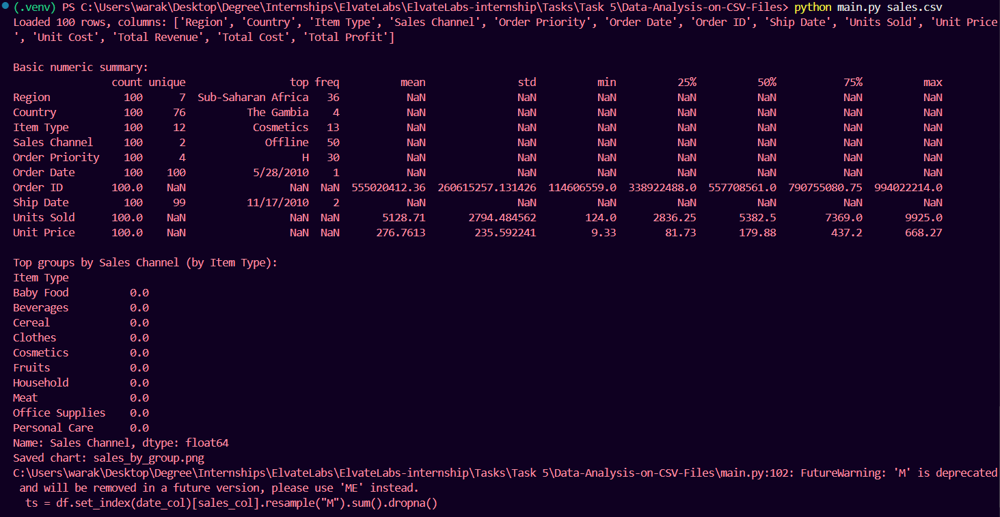
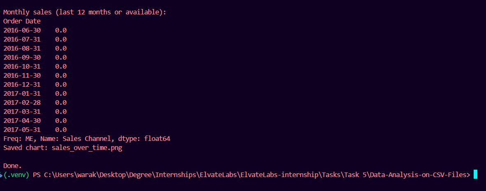

<h2 align="center"># 📊 Data Analysis on CSV File</h2>


---

## 📘 Project Overview

This project performs **data analysis on a CSV file** named `sales.csv`. The dataset contains sales-related data such as product names, prices, quantities, and total revenue. The goal is to analyze, summarize, and visualize the sales data to extract useful insights using Python libraries like **Pandas** and **Matplotlib**.

---

## 🎯 Objective

* To load and clean data from a `sales.csv` file.
* To perform **data analysis and visualization** to understand key business metrics.
* To display statistical summaries like total sales, average sales, and top-performing products.

---

## 🛠️ Technologies Used

* **Python 3.x**
* **Pandas** – for data manipulation and analysis
* **Matplotlib / Seaborn** – for visualization
* **Jupyter Notebook / VS Code** – for code execution and visualization

---

## 💻 Code Implementation

```python
import sys
import argparse
from pathlib import Path
import pandas as pd

#!/usr/bin/env python3
"""
main.py - Simple CSV sales analysis using pandas and matplotlib.

Usage:
    python main.py path/to/sales.csv

This script:
- Loads a CSV file (auto-detects common column names)
- Prints basic summary (rows, numeric describe)
- Aggregates sales by category/product and by month (if Date present)
- Saves two charts: sales_by_group.png and sales_over_time.png
"""


import matplotlib.pyplot as plt


COMMON_SALES_KEYS = ("sales", "amount", "total", "revenue")
COMMON_PRODUCT_KEYS = ("product", "item", "sku", "name")
COMMON_CATEGORY_KEYS = ("category", "cat", "department")


def find_column(df, candidates):
    lower = {c.lower(): c for c in df.columns}
    for cand in candidates:
        for col_lower, col_orig in lower.items():
            if cand in col_lower:
                return col_orig
    return None


def main():
    parser = argparse.ArgumentParser(description="Basic sales CSV analysis")
    parser.add_argument("csv", nargs="?", default="sales.csv", help="Path to CSV file")
    args = parser.parse_args()

    path = Path(args.csv)
    if not path.exists():
        print(f"File not found: {path}", file=sys.stderr)
        sys.exit(2)

    df = pd.read_csv(path)
    if df.empty:
        print("CSV is empty", file=sys.stderr)
        sys.exit(1)

    print(f"Loaded {len(df)} rows, columns: {list(df.columns)}\n")

    # detect useful columns
    sales_col = find_column(df, COMMON_SALES_KEYS)
    product_col = find_column(df, COMMON_PRODUCT_KEYS)
    category_col = find_column(df, COMMON_CATEGORY_KEYS)
    date_col = find_column(df, ("date", "order_date", "timestamp"))

    # show basic numeric summary
    print("Basic numeric summary:")
    print(df.describe(include="all").transpose().head(10))
    print()

    # Ensure sales column exists or try to compute from Quantity * Price
    if sales_col is None:
        qty_col = find_column(df, ("quantity", "qty"))
        price_col = find_column(df, ("price", "unit_price"))
        if qty_col and price_col:
            sales_col = "computed_sales"
            df[sales_col] = pd.to_numeric(df[qty_col], errors="coerce") * pd.to_numeric(df[price_col], errors="coerce")
            print(f"Computed sales as {qty_col} * {price_col} into column '{sales_col}'")
        else:
            print("No sales column detected and cannot compute sales. Exiting.", file=sys.stderr)
            sys.exit(3)
    else:
        df[sales_col] = pd.to_numeric(df[sales_col], errors="coerce")

    # Group by category or product
    group_col = category_col or product_col
    if group_col:
        grouped = df.groupby(group_col)[sales_col].sum().sort_values(ascending=False)
        print(f"Top groups by {sales_col} (by {group_col}):")
        print(grouped.head(10))
        # Plot bar chart
        plt.figure(figsize=(10, 6))
        grouped.plot(kind="bar")
        plt.ylabel(sales_col)
        plt.title(f"Sales by {group_col}")
        plt.tight_layout()
        out1 = "sales_by_group.png"
        plt.savefig(out1)
        plt.close()
        print(f"Saved chart: {out1}")
    else:
        print("No product/category column found; skipping group plot.")

    # Time series if date exists
    if date_col:
        df[date_col] = pd.to_datetime(df[date_col], errors="coerce")
        ts = df.set_index(date_col)[sales_col].resample("M").sum().dropna()
        if not ts.empty:
            print("\nMonthly sales (last 12 months or available):")
            print(ts.tail(12))
            plt.figure(figsize=(10, 5))
            ts.plot(marker="o")
            plt.ylabel(sales_col)
            plt.title("Sales over time (monthly)")
            plt.tight_layout()
            out2 = "sales_over_time.png"
            plt.savefig(out2)
            plt.close()
            print(f"Saved chart: {out2}")
        else:
            print("No valid date->sales data for time series.")
    else:
        print("No date column detected; skipping time series plot.")

    print("\nDone.")


if __name__ == "__main__":
    main()
```

---

## ⚙️ How It Works

1. Load `sales.csv` into a Pandas DataFrame.
2. Explore and clean the data by checking missing values.
3. Analyze total and average sales.
4. Visualize the top-performing products and monthly sales trends.

---

## 🧾 Task and Output

### 📊 Analysis Output 1



### 📈 Analysis Output 2



---

## ✅ Results

* Successfully loaded and analyzed data from `sales.csv`.
* Displayed important insights such as:

  * Total sales per product.
  * Top-performing items.
  * Monthly trends and statistics.
* Created clear and informative data visualizations.

---

## 🧑‍🏫 Author
**Prathamesh Sitaram Warak**  
B.E. Information Technology | Atharva College of Engineering  
Passionate about coding, cybersecurity,AI-ML and building real-world tech projects.
